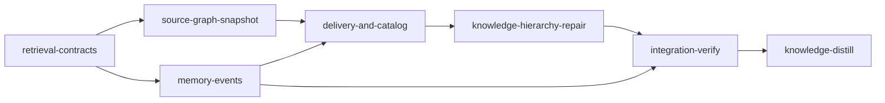

# Plan: Knowledge and Source Graph Contracts

## Overview

`doc/codex-knowledge-source-graph-eval.md` (2026-09-09, reviewed at `bacb94d3`) found four correctness failures in normal context use and fourteen design or efficiency weaknesses across retrieval, the source graph, the prompt hook, the knowledge catalog, memory capture and distillation. Six read-only opus agents re-grounded every finding against HEAD before this plan was written; all eighteen hold, with the line-number corrections carried into the briefs. This plan closes the twelve behavioral contracts the report specifies and the standalone-operation requirements, in four implementation stages plus a knowledge-repair stage, with `gpt-5.6-sol` codex units doing the implementation wherever the work is mechanical enough to specify exactly.

The report's own priorities are followed: correctness and truthful measurement first (required items, tombstones, working-tree freshness, overlay selection, lifecycle eligibility, the unwired stage budget, the mislabeled metric, the sync-to-init reuse contract), then context reduction (authority filtering, per-item admission, rendered-cost charging, bounded navigation, corrected maintenance doctrine), then durable capture with receipts, then the graph-backed pieces the current design can absorb (source-lane expansion, typed evidence, a real hierarchy), and the hot-path work only where it falls out of the snapshot contract. Semantic retrieval, LSP/SCIP evidence, a persistent conversational task envelope, and subagent dispatch packets are explicit non-goals (see "Not built here").

## Goals

- Every "Behavioral contracts" row in the report has a discriminating regression test and the production path that satisfies it.
- Loom works as a standalone context tool: `loom map` without `loom init`, a durable memory archive that survives cleanup, a visible pending queue, and doctrine that no longer states false things about deletion or append-only files.
- Budgets, freshness labels, counters and metrics say what they measure.
- Implementation stays delegated: every stage's main agent is an opus orchestrator; the units are `gpt-5.6-sol` codex where the acceptance is mechanical and Claude sonnet where the sandbox or the judgment demands it.

## Not built here (explicit non-goals)

- A persistent conversational task envelope for the prompt hook (F17's "carry the envelope across corrections") and per-subagent dispatch packets: Claude Code's `SubagentStart` hook cannot inject `additionalContext` for a Task child, so a packet has no delivery surface today. The pieces that do have a surface are built (stage query text without orchestration vocabulary; recipient-scoped delivery unchanged; skill suggestions scoped by request).
- Claim-level stable IDs across the whole corpus and summaries declaring coverage of claim IDs (F8/F11's fuller design). Built instead: per-file `sources:`/`verified:` evidence with a review trigger, typed source references, and a real tier-1/tier-2 split of the six oversized summaries.
- Semantic (embedding) retrieval, LSP or SCIP evidence, a resident graph service. The snapshot contract makes reconciliation incremental first; the report says to measure before adding infrastructure.
- Any fix to the container backend, the web dashboard, or files those in-progress plans own.

## Report findings to stages

| Finding | Where it is fixed | Contract row |
| --- | --- | --- |
| F1 required ids silently omitted | `retrieval-contracts` A1 (reservation, `unmet_required`), A3 (exit 3, `--require-compact`) | Required knowledge |
| F2 edits at unchanged HEAD labeled current | `source-graph-snapshot` B1 (working-tree generation on every overlay; retrieval marks stale) | Working-tree snapshot |
| F3 deleted files resurrected | B1 (tombstones, `FileCoverage::Deleted`) | Working-tree snapshot |
| F4 prompt hook reads the local overlay inside a stage | `delivery-and-catalog` C1 (`HookTarget`, one address for reader and writers) | Overlay isolation |
| F5 untracked files invisible | B1 (index plus untracked in overlays; never in a base) | Working-tree snapshot |
| F6 one item admits a weak brief | C1 (per-item admission, floor re-checked after suppression, abstention) | Delivery suppression, Eligibility and abstention |
| F7 lifecycle not an eligibility policy; proposals rank as current | A1 (`LifecyclePolicy`), D1 (prose lifecycle by path) | Eligibility and abstention |
| F8 freshness is index freshness | D1 (`verified:` + `EvidenceChanged` review trigger), K (annotate the touched topics, correct the contradictions) | Evidence diagnostics |
| F9 memory has no identity or receipt | `memory-events` E1 (ids, evidence, session, locked append), E2 (`resolve`, `pending`) | Curation recovery |
| F10 distillation is the only maintenance; docs false | E2 (archive on completion and cleanup), E3 (distill signal, `/distill`, pre-compact, handoff, templates) | Curation recovery |
| F11 hierarchy by line count | D1 (limits made honest), K (six tier-1 files split into topics) | Incremental summaries (the summary half) |
| F12 excerpts and budgets misaligned; stage budget unwired | A1 (rendered-cost charging, match-centred excerpt, frame cost), A3 (config wiring) | Budget and excerpts |
| F13 source lane ignores edges; impact uncontrollable | A2 (bounded seeded expansion), B3 (`--depth/--kinds/--limit/--path`, callers/callees, JSON, one footer) | — |
| F14 repeated reconciliation and double evaluate | A1 (one evaluate per retrieval), B1 (one fingerprint per refresh), B2 (`ensure_snapshot` fast path everywhere) | Repeated maintenance |
| F15 hit rate named precision; delivery untested | D2 (hit rate, true precision, relevant-token fraction, mandatory recall, abstention, rendered cost) | Quality metrics |
| F16 telemetry unread; 111 false missing-source refs | C2 (spooled events, pulls, abstentions, `loom knowledge telemetry`), D1 (typed references) | Evidence diagnostics |
| F17 orchestration vocabulary in queries; skill injection by repo type | A3 (stage query text), C3 (skill-trigger scoring) | Recipient scope (delivery keying unchanged, documented) |
| F18 sync and init disagree; counters lie; identical index writes | B1 (committed-content bases, `blob_index` reuse, counters), B2 (`ensure_snapshot`, identical-index skip, regression suite) | Repeated maintenance |

## Baseline at HEAD (`bacb94d3`, measured 2026-09-10 from the main checkout)

| Command | Result |
| --- | --- |
| `cargo build --manifest-path loom/Cargo.toml` | ok |
| `cargo clippy --manifest-path loom/Cargo.toml --all-targets -- -D warnings` | ok |
| `cargo fmt --check --manifest-path loom/Cargo.toml` | ok |
| `cargo test --manifest-path loom/Cargo.toml --all-targets` | 3905 passed, 0 failed, 1 ignored (lib) plus every integration target green |
| `cargo test --lib context::` / `commands::hook::` / `commands::knowledge::` / `fs::knowledge::` | 397 / 70 / 68 / 99 passed |
| `cargo test --lib fs::memory::` / `commands::memory::` / `commands::run::` / `commands::init::` | 31 / 13 / 30 / 38 passed |
| `cargo test --lib orchestrator::signals::` / `map::` / `telemetry::` / `commands::map` | 178 / 8 / 5 / 0 passed |
| `loom knowledge sync` | catalog current; base published for `bacb94d3` (1575 files, 14274 nodes) |
| `loom knowledge check` | 127 issues: 111 MissingSourceRef, 7 GenericBlurb, 6 OversizedFile, 1 OversizedIndex, 1 BrokenLink, 1 OversizedSection |

Every acceptance command below is one of these, a name-filtered subset of one, or a `--help` grep against the binary the stage just built. The knowledge tree is populated (77 files) and `sync` runs clean, so `knowledge-bootstrap` is skipped per the plan-writer rule.

## Sibling plans

- `PLAN-secure-distilled-loom-v2.md` (not started, no loom metadata) sketches a broader restructure of `loom/src/context/` and `loom/src/fs/knowledge/`. It has no stage YAML, so it builds nothing this plan must honor; it must be re-based on the merged tree after this plan.
- `IN_PROGRESS-PLAN-fix-knowledge-bootstrap-macos.md` declares `src/commands/knowledge/bootstrap.rs` and an integration-verify over `src/**/*.rs` (working_dir `loom`). This plan does not touch `bootstrap.rs`. `IN_PROGRESS-PLAN-web-dashboard.md` and `IN_PROGRESS-PLAN-embed-assets-and-complete-self-update.md` own `loom/src/commands/status/**`, `web/**`, `loom/src/assets/**`; disjoint. `.loom/work/config.toml` currently points at `DONE-PLAN-web-terminal.md`, so no plan is executing.

## Execution diagram



`memory-events` runs in parallel with `source-graph-snapshot`, both after `retrieval-contracts`: it shares `cli/types_memory.rs`, `cli/dispatch.rs` and the signals module with the foundation stage (different regions of the same files), and loom refuses concurrent writers of one file, so it waits for that merge rather than racing it.

## Stage necessity

- `retrieval-contracts` — Q1: every later stage compiles against the fields and variants its foundation unit adds to `ContextPack`, `ContextItem`, `StageQuery`, `GraphLayer`, `FileCoverage`, `LifecycleState`, `SelectionReason`; those types are built as full struct literals in five modules, so the additions and the literal sweep must merge first.
- `source-graph-snapshot` — Q1 and Q2: it rewrites `refresh/**` and `graph_store/**` (which `retrieval-contracts` A0 touches for `GraphLayer`) and `commands/hook/reconcile_graph.rs` (which `delivery-and-catalog` rewires), and `delivery-and-catalog` calls its `ensure_snapshot`.
- `memory-events` — Q2: it writes `cli/types_memory.rs`, `cli/dispatch.rs` and two signals files that `retrieval-contracts` also writes, so it cannot share a level with it, and it is kept out of that stage because the stage already carries four codex units; it runs in parallel with `source-graph-snapshot`, with which it shares nothing.
- `delivery-and-catalog` — Q1: C1 needs `ensure_snapshot`, C2 needs the memory spool pattern and archive, D2 needs `unmet_required`, D1 needs `LifecycleState::Historical`. Hooks and catalog share one stage because their five units write disjoint files and neither needs the other merged.
- `knowledge-hierarchy-repair` — Q1 and Q3: it needs `annotate` and the typed-evidence `check` merged (its gate is `check --strict` under the new semantics), and it is a knowledge-type stage in the main checkout, which cannot share a worktree stage.
- `integration-verify`, `knowledge-distill` — bookends.

## Lane and spawn rules (every implementation stage)

Each stage's main agent is an opus orchestrator and never implements. Codex units are spawned as `loom-codex-forwarder` subagents in the FOREGROUND with `--model gpt-5.6-sol --effort xhigh`, an explicit Bash timeout of 600000 ms (the tool's maximum), and a DISJOINT file set; each prompt is the fixed preamble plus `Your brief: <path>. Read it in full before anything else.` Every codex worker is told NOT to run git at all; the orchestrator checks `git status --short` after each run and re-reads the tree before briefing the next wave. Claude units are spawned BY AGENT TYPE (`loom-software-engineer`) with CLAUDE.md Rule 5's preamble. Codex cannot see edits made during the stage through `loom map`/`loom knowledge context` (they answer from the published base), so every wave-1 brief names what wave 0 changed. Verification (build, clippy, fmt, the stage's test filters, the mini adversarial review) is the orchestrator's; a unit runs at most one narrow check once.

## Stages

### 1. `retrieval-contracts`

Foundation unit A0 (alone), then A1, A2, A3 in parallel. Briefs under `doc/plans/briefs/knowledge-source-graph-contracts/retrieval-contracts/`.

| Worker | Role | Tier | Files owned | Shared context | Brief |
| --- | --- | --- | --- | --- | --- |
| A0 | Shared type foundation, behavior-neutral; `context/render.rs` | codex sol | `context/schema.rs`, `context/retrieve.rs` (StageQuery only), `graph_store/mod.rs` (GraphLayer), `source_graph/node.rs`, `context/render.rs`, `context/mod.rs`, `orchestrator/signals/format/brief.rs`, `context/fuse.rs` (has_exact_rung), `map/views/mod.rs` (one arm), every struct-literal site listed in the brief | — | `a0-foundation-types.md` |
| A1 | Required-item reservation, rendered-cost charging, match-centred excerpts, lifecycle filter, one evaluate | codex sol | `context/pack.rs` + `pack/**`, `context/retrieve.rs`, `retrieve/channels.rs`, `commands/hook/user_prompt_compose.rs` (`carrying` only), `context/tests/{pack,pack_twins,pack_source,retrieve}.rs`, `retrieve/channels/tests.rs` | `schema.rs`, `render.rs` (read) | `a1-pack-and-retrieve.md` |
| A2 | Bounded seeded graph expansion in the source lane | codex sol | `context/rank_source.rs`, `rank_source/expand.rs`, `context/tests/rank_source_expand.rs`, `tests/mod.rs` (one line) | `rank.rs`, `fuse.rs`, `graph_store/mod.rs` (read) | `a2-source-lane-expansion.md` |
| A3 | `--history`/`--require-compact`/exit 3, stage budget from config, query text without orchestration vocabulary, unmet lines and frame-cost test in the brief | codex sol | `commands/knowledge/context.rs` (+ `context/print.rs`), `tests_context.rs`, `cli/types_memory.rs` (Context variant), `cli/dispatch.rs` (Context arm), `orchestrator/signals/retrieval.rs`, `signals/format/brief*.rs`, `signals/tests_brief_*.rs` | `schema.rs` (may raise `BRIEF_FRAME_TOKENS` only) | `a3-cli-stage-brief-render.md` |

Contracts pinned across the wave: A0 defines `LifecyclePolicy`, `RequiredRepresentation`, `UnmetRequirement`, `ContextPack::unmet_required`, `ContextItem::truncated`, `BRIEF_FRAME_TOKENS = 128`, `ContextPack::recompute_estimate`, `SelectionReason::GraphNeighbor` (never an exact rung), `LifecycleState::Historical`, `FileCoverage::Deleted`, `GraphLayer::{generation, blob_index}`, and `context::render::rendered_item_tokens`. A1 charges `rendered_item_tokens`; A3 measures the frame with `brief_tests::frame_cost_is_within_the_constant`. Decision recorded: the lifecycle filter is applied post-ranking (the lexical index stays whole; only admission changes), and `Current` means `Active` plus `Draft`.

### 2. `source-graph-snapshot`

B1 alone, then B2 and B3 in parallel. Briefs under `.../source-graph-snapshot/`.

| Worker | Role | Tier | Files owned | Shared context | Brief |
| --- | --- | --- | --- | --- | --- |
| B1 | Enumeration (index + untracked; committed tree for bases), tombstones, working-tree generation, `blob_index` reuse without reading, counters and timings, one fingerprint per refresh, retrieval marks a moved generation stale; compile-fixes in the callers | codex sol | `context/refresh.rs`, `refresh/source_graph.rs` (+ submodules), `refresh/semantic.rs`, `graph_store/mod.rs`, `retrieve/graph.rs`, `retrieve.rs` (consumer lines), their tests; compile-fix only: `commands/run/checks.rs`, `commands/knowledge/sync.rs`, `orchestrator/merge_lifecycle.rs`, `commands/hook/reconcile_graph.rs`, `commands/run/tests.rs`, `tests_sync.rs` | `git/runner.rs` (read) | `b1-snapshot-identity.md` |
| B2 | `ensure_snapshot` decision path; init/run preflight, `loom map` without `loom init`, sync and the hook's checkout arm through it; identical-index skip; reuse regression suite; `MapArgs` flags and single footer | codex sol | `refresh/snapshot.rs`, `refresh/semantic.rs`, `refresh/tests_snapshot.rs`, `commands/run/checks.rs` (+ `checks/graph_messages.rs`), `commands/run/tests.rs`, the three preflight call lines in `init/execute.rs`, `run/mod.rs`, `run/foreground.rs`, `commands/map.rs` (+ `tests_map.rs`), `commands/knowledge/sync.rs`, `tests_sync.rs`, `fs/knowledge/index.rs` (`write_index`) + its test, `orchestrator/merge_lifecycle.rs` | B3's view signatures (pinned in both briefs) | `b2-ensure-snapshot.md` |
| B3 | `ImpactOptions`/`impact_with`, direct callers/callees, `render_footer`, JSON views | codex sol | `context/resolve/impact.rs`, `resolve/neighbors.rs`, `resolve/tests_*.rs`, `map/views/mod.rs`, `views/json.rs`, `views/tests.rs`, `map/mod.rs` | `commands/map.rs` (read) | `b3-map-query-surface.md` |

Decisions recorded: a base is built from committed content (`git show HEAD:<path>` for dirty paths, `git ls-tree` for the file set) so a dirty tree never refuses a base and `sync`, `init` and `run` agree; freshness of an overlay is its `generation` (HEAD plus a hash of the dirty paths' content), compared where the overlay is read; `SemanticLayer::LocalOverlay { refusal }` is deleted. B2 and B3 edit disjoint files and meet at the signatures quoted in both briefs; the orchestrator builds only after both return.

### 3. `memory-events`

E1 alone, then E2 (codex) and E3 (Claude sonnet, because `hooks/` accepts only Edit/Write) in parallel. Briefs under `.../memory-events/`.

| Worker | Role | Tier | Files owned | Shared context | Brief |
| --- | --- | --- | --- | --- | --- |
| E1 | `MemoryEntry` gains id, full timestamp, session, evidence, `Receipt`; locked append; `--evidence`, `--json` | codex sol | `fs/memory/**` (except `archive.rs`), `commands/memory/handlers/{record,read,tests}.rs`, `formatters.rs`, `mod.rs`, `cli/types_memory.rs` (MemoryCommands), `cli/dispatch.rs` (memory arms), literal/match sites in `commands/review/generate.rs`, `orchestrator/monitor/handlers.rs`, `orchestrator/core/spool_drain_tests.rs` | — | `e1-event-identity.md` |
| E2 | `loom memory resolve`, `loom memory pending [--strict]`, archive on plan completion and cleanup, `.gitignore` | codex sol | `commands/memory/handlers/{resolve,pending,tests_resolve_pending}.rs`, `handlers/mod.rs`, `commands/memory/mod.rs`, `cli/types_memory.rs` (two variants), `cli/dispatch.rs` (two arms), `fs/memory/archive.rs`, `fs/memory/mod.rs` (declaration), `fs/plan_lifecycle.rs`, `commands/clean/mod.rs`, `commands/init/cleanup.rs`, `.gitignore` | E1's files (read) | `e2-receipts-pending-archive.md` |
| E3 | Truthful distill doctrine, `/distill`, pre-compaction, handoff memory path, plan-writer and CLAUDE templates | sonnet | `hooks/pre-compact.sh`, `commands/distill.md`, `orchestrator/signals/cache.rs` (distill prefix), `signals/format/sections.rs` (memory tables), `signals/tests_doctrine*.rs`, `commands/handoff/create.rs` (+ tests), `skills/loom-plan-writer/SKILL.md` (distill bookend), `CLAUDE.md.template` (Rules 5 and 12) | E1/E2 CLI spellings | `e3-signals-docs-hooks.md` |

Decisions recorded: receipts are ordinary journal entries (`MemoryEntryType::Receipt`) so the existing spool and drain carry them out of a sandboxed worktree; `Change` entries are exempt from receipts; the archive is written only by host-side code paths (`clean`, `init --clean`, plan completion), never by a stage session.

### 4. `delivery-and-catalog`

Five units in one wave, disjoint files. Briefs under `.../delivery-and-catalog/`.

| Worker | Role | Tier | Files owned | Shared context | Brief |
| --- | --- | --- | --- | --- | --- |
| C1 | `HookTarget` for all three hooks, the prompt hook reads its stage overlay, per-item admission and abstention, `would_emit` | codex sol | `commands/hook/{target,user_prompt,user_prompt_compose,pre_compact,reconcile_graph}.rs`, `hook/mod.rs`, `hook/tests_*.rs`, `tests_hook_target.rs` | `telemetry` variants (pinned), `ensure_snapshot` | `c1-hook-target-and-admission.md` |
| C2 | Telemetry events with a spool, drained by the daemon; `ContextPulled` from `loom knowledge context`; `loom knowledge telemetry` | codex sol | `telemetry/**`, `commands/knowledge/telemetry.rs`, `commands/knowledge/context.rs` (one emit), `orchestrator/core/spool_drain.rs`, `git/cleanup/{batch,worktree}.rs`, `git/worktree/settings.rs`, `context/delivery.rs`, `.gitignore`, `commands/knowledge/tests_telemetry.rs` | C1 calls its variants; D1 declares its module and CLI arm | `c2-telemetry-loop.md` |
| C3 | Skill suggestions scoped by the request | sonnet | `hooks/skill-trigger.sh`, `loom/tests/integration/hooks_skill_{project,trigger}.rs` | `commands/hook/project_types.rs` (read) | `c3-skill-trigger-scoping.md` |
| D1 | Prose lifecycle by path, typed source references, `verified:` + `EvidenceChanged`, `loom knowledge annotate` (incl. `--blurb`), honest index limits, both new `KnowledgeCommands` variants | codex sol | `fs/knowledge/**` (except `index.rs::write_index`), `commands/knowledge/{check,annotate,mod}.rs`, `tests_check.rs`, `tests_annotate.rs`, `cli/types_memory.rs` (KnowledgeCommands), `cli/dispatch.rs` (knowledge arms), `context/ingest.rs` if needed | `context/schema.rs` (read) | `d1-catalog-authority-and-evidence.md` |
| D2 | Truthful eval metrics and gates; case file | codex sol | `commands/knowledge/eval.rs` (+ `eval/**`), `tests_eval.rs`, `loom/eval/retrieval-cases.yaml` | C1's `would_emit` (pinned path) | `d2-eval-metrics.md` |

Pinned cross-unit contracts: `crate::telemetry::TelemetryEvent::{PromptBrief, PromptAbstained, ContextPulled}` with the field names in C2's brief (C1 calls them); `crate::commands::hook::user_prompt::would_emit(&ContextPack, &RetrievalConfig) -> bool` (D2 calls it); `commands::knowledge::telemetry::telemetry(Option<String>, bool) -> Result<()>` (D1 dispatches it and declares `pub mod telemetry;`). The orchestrator builds only after all five return and reconciles any signature drift itself before the gate.

### 5. `knowledge-hierarchy-repair` (stage_type `knowledge`)

Runs in the main checkout after `delivery-and-catalog` merges, using the binary it builds (`loom/target/debug/loom`) for `annotate`, `check` and the writes. The orchestrator applies the correction passes to the four architecture topics this plan changed and to the contradicted `knowledge-hierarchy.md` sections, then spawns six sonnet subagents, one per oversized tier-1 file, each splitting its file into cohesive tier-2 topics through the CLI. Brief: `.../knowledge-hierarchy-repair/k-tier1-split-and-corrections.md` (the assignment table is inside it). Gate: `check --strict` under the new semantics, no generic blurbs, the stale claims gone.

### 6. `integration-verify`

Full gate with zero tolerance, three parallel `loom-code-reviewer` subagents (security via `Skill(skill="loom-skills", args="loom-security-audit")`, architecture, test coverage), fixes through an engineer agent, and functional verification that the new surfaces are reachable in the built binary: `loom knowledge context --help` lists `--history` and `--require-compact`; `loom map --help` lists `--callers`, `--callees`, `--depth`, `--kinds`, `--limit`, `--path`, `--min-confidence`, `--json`; `loom memory --help` lists `resolve` and `pending`; `loom knowledge --help` lists `annotate` and `telemetry`. Manual smoke from the worktree (reads only): `loom/target/debug/loom knowledge context --query "context retrieval subsystem" --require-id "entry-points.md#context-retrieval-subsystem-2026-08-17#0" --budget-tokens 500` must exit 3 and print the unmet line (the report's F1 reproduction); `loom/target/debug/loom map --callers retrieve_for_stage --limit 5` prints at most five rows and one footer.

### 7. `knowledge-distill`

Single-agent sonnet, standard template; acceptance uses the built binary's `check --strict` because the PATH binary predates the review-only issue kinds.

## After this plan

Run `./dev-install.sh` so the daemon, hooks and future stages use the new binary: receipts, `pending`, `annotate`, `telemetry` and the snapshot fast path exist only there. The untracked design documents in `doc/` (`codex-knowledge-source-graph-eval.md`, `token-optimization-*.md`, `fable-optimization-suggestions-*.md`, `merge-resolve-bug-notes.md`) are indexed as prose in the main checkout; the path rules mark `REPORT-`/`PROPOSAL-` files historical, and the review itself can be marked with `state: historical` frontmatter once it is committed or retired. Re-base `PLAN-secure-distilled-loom-v2.md` on the merged tree before writing its stages.

## Sandbox

Copied from the last completed plan and widened only for the files this plan writes outside `loom/**`: two hook scripts (Edit/Write tools only), `commands/distill.md`, the plan-writer skill, `CLAUDE.md.template`, `.gitignore`, `README.md`. Knowledge-type stages receive `doc/loom/knowledge/**` automatically. Network stays the crates.io trio for a cold worktree build.

---

<!-- loom METADATA -->

```yaml
loom:
  version: 1
  sandbox:
    enabled: true
    auto_allow: true
    allow_unsandboxed_escape: false
    excluded_commands: []
    filesystem:
      deny_read:
        - ~/.ssh/**
        - ~/.aws/**
        - ~/.config/gcloud/**
        - ~/.gnupg/**
        - ~/.claude/.credentials.json
        - .loom/work/admin.token
        - .loom/work/user.token
        - ../.loom/work/admin.token
        - ../.loom/work/user.token
        - .work/admin.token
        - .work/user.token
        - ../.work/admin.token
        - ../.work/user.token
        - ../../**
        - ../.worktrees/**
      deny_write:
        - ../../**
      allow_write:
        - loom/**
        - hooks/pre-compact.sh
        - hooks/skill-trigger.sh
        - commands/distill.md
        - skills/loom-plan-writer/SKILL.md
        - CLAUDE.md.template
        - .gitignore
        - README.md
        - doc/plans/REVIEW-*.md
    network:
      allowed_domains:
        - crates.io
        - static.crates.io
        - index.crates.io
      additional_domains: []
      allow_local_binding: false
      allow_unix_sockets: []
      allow_all_unix_sockets: false
    linux:
      enable_weaker_nested: false
    command_confinement: confined
  stages:
    - id: retrieval-contracts
      name: "Retrieval Contracts"
      stage_type: standard
      model: "opus"
      reasoning_effort: "high"
      implementers: ["codex", "claude"]
      subagent_timeout_secs: 1800
      description: |
        Close F1, F7, F12, F13 (ranking half), F14 (retrieval half) and F17 (stage query text)
        from doc/codex-knowledge-source-graph-eval.md, and lay the shared type foundation every
        later stage compiles against. Use parallel subagents and skills to maximize performance.
        Read doc/plans/PLAN-knowledge-source-graph-contracts.md section 1 for the worker table.

        WAVE 0 (alone): A0, brief doc/plans/briefs/knowledge-source-graph-contracts/retrieval-contracts/a0-foundation-types.md
        - behavior-neutral type additions, context/render.rs, every struct-literal site fixed.
        Build after A0 returns (cargo build --manifest-path loom/Cargo.toml) before spawning wave 1.
        WAVE 1 (parallel, disjoint files): A1 a1-pack-and-retrieve.md, A2 a2-source-lane-expansion.md,
        A3 a3-cli-stage-brief-render.md, same directory.

        All four units are loom-codex-forwarder subagents spawned in the FOREGROUND with
        --model gpt-5.6-sol --effort xhigh, an explicit Bash timeout of 600000 ms, and the prompt
        "Your brief: <path>. Read it in full before anything else." Tell every codex worker NOT to
        run git at all; check git status --short after each run. Codex cannot see wave-0 edits
        through loom map (base layer only) - the wave-1 briefs say so; do not paste file bodies.

        Territories are DISJOINT (see the plan's table); workers NEVER spawn subagents.
        After wave 1: run the gate (build, clippy --all-targets -D warnings, fmt --check, the
        acceptance test filters), fix findings through a fresh sonnet or sol unit briefed with the
        failure, run the mini adversarial review, then commit by concern (types foundation;
        packing/retrieval; source-lane expansion; CLI and brief) and complete.

        MEMORY: record mistakes, decisions and surprises via loom memory immediately (plain
        notes - the --evidence flag exists only after memory-events merges); NEVER loom knowledge
        in an implementation stage; NEVER Claude Code auto-memory.
      dependencies: []
      acceptance:
        - 'cargo build --manifest-path loom/Cargo.toml'
        - 'cargo clippy --manifest-path loom/Cargo.toml --all-targets -- -D warnings'
        - 'cargo fmt --check --manifest-path loom/Cargo.toml'
        - 'cargo test --manifest-path loom/Cargo.toml --lib context::'
        - 'cargo test --manifest-path loom/Cargo.toml --lib commands::knowledge::'
        - 'cargo test --manifest-path loom/Cargo.toml --lib commands::hook::'
        - 'cargo test --manifest-path loom/Cargo.toml --lib orchestrator::signals::'
        - 'cargo test --manifest-path loom/Cargo.toml --lib map::'
        - 'cargo test --manifest-path loom/Cargo.toml --lib commands::run::'
        - '! rg -qF "STAGE_BRIEF_BUDGET_TOKENS" loom/src/orchestrator/signals/retrieval.rs'
      files:
        - loom/src/context/**
        - loom/src/commands/knowledge/context.rs
        - loom/src/commands/knowledge/context/**
        - loom/src/commands/knowledge/tests_context.rs
        - loom/src/cli/types_memory.rs
        - loom/src/cli/dispatch.rs
        - loom/src/orchestrator/signals/retrieval.rs
        - loom/src/orchestrator/signals/format/brief.rs
        - loom/src/orchestrator/signals/format/brief_tests.rs
        - loom/src/orchestrator/signals/format/brief_tests_confidence.rs
        - loom/src/orchestrator/signals/tests_brief_rendering.rs
        - loom/src/orchestrator/signals/tests_brief_e2e.rs
        - loom/src/commands/hook/**
        - loom/src/map/views/mod.rs
        - loom/src/commands/run/tests.rs
      working_dir: "."
      artifacts:
        - loom/src/context/render.rs
        - loom/src/context/rank_source/expand.rs
        - loom/src/context/tests/rank_source_expand.rs
      wiring:
        - source: "loom/src/context/pack.rs"
          pattern: 'rendered_item_tokens\('
          description: "Packing charges the rendered cost of each item"
        - source: "loom/src/context/rank_source.rs"
          pattern: 'expand_from_seeds\('
          description: "Source ranking calls the seeded graph expansion"
        - source: "loom/src/orchestrator/signals/retrieval.rs"
          pattern: 'stage_brief_budget_tokens'
          description: "The stage brief budget is read from RetrievalConfig"
        - source: "loom/src/context/retrieve/channels.rs"
          pattern: '= apply_lifecycle_policy\('
          description: "Lifecycle eligibility is applied before fusion"
        - source: "loom/src/commands/knowledge/context.rs"
          pattern: 'RequiredRepresentation::Compact'
          description: "The --require-compact flag selects the compact representation"
        - source: "loom/src/commands/knowledge/context.rs"
          pattern: 'LifecyclePolicy::Historical'
          description: "The --history flag selects the historical policy"

    - id: source-graph-snapshot
      name: "Source Graph Snapshot Service"
      stage_type: standard
      model: "opus"
      reasoning_effort: "high"
      implementers: ["codex", "claude"]
      subagent_timeout_secs: 1800
      description: |
        Close F2, F3, F5, F13 (navigation half), F14 (map and refresh halves) and F18 from
        doc/codex-knowledge-source-graph-eval.md. Use parallel subagents and skills to maximize
        performance. Read doc/plans/PLAN-knowledge-source-graph-contracts.md section 2 for the
        worker table and the decisions (committed-content bases, per-overlay generation).

        WAVE 0 (alone): B1, brief doc/plans/briefs/knowledge-source-graph-contracts/source-graph-snapshot/b1-snapshot-identity.md
        - enumeration, tombstones, generation, blob_index reuse, counters, one fingerprint pass,
        plus compile-fixes in the four caller files it names. Build after B1 returns.
        WAVE 1 (parallel, disjoint files): B2 b2-ensure-snapshot.md and B3 b3-map-query-surface.md.
        B2 calls B3's view functions by the signatures pinned in BOTH briefs; build only after both
        return and reconcile any signature drift yourself before the gate.

        All three units are loom-codex-forwarder subagents spawned in the FOREGROUND with
        --model gpt-5.6-sol --effort xhigh, an explicit Bash timeout of 600000 ms, and
        "Your brief: <path>. Read it in full before anything else." Tell every codex worker NOT to
        run git; check git status --short after each run. Wave-1 briefs state what B1 changed
        because codex's loom map cannot see it.

        Territories are DISJOINT; workers NEVER spawn subagents. Gate, fix through a fresh unit,
        mini adversarial review, commit by concern (snapshot identity; ensure_snapshot and
        callers; map query surface), complete.

        MEMORY: loom memory for mistakes/decisions/surprises immediately; NEVER loom knowledge;
        NEVER auto-memory.
      dependencies: ["retrieval-contracts"]
      acceptance:
        - 'cargo build --manifest-path loom/Cargo.toml'
        - 'cargo clippy --manifest-path loom/Cargo.toml --all-targets -- -D warnings'
        - 'cargo fmt --check --manifest-path loom/Cargo.toml'
        - 'cargo test --manifest-path loom/Cargo.toml --lib context::'
        - 'cargo test --manifest-path loom/Cargo.toml --lib commands::run::'
        - 'cargo test --manifest-path loom/Cargo.toml --lib commands::map'
        - 'cargo test --manifest-path loom/Cargo.toml --lib map::'
        - 'cargo test --manifest-path loom/Cargo.toml --lib commands::knowledge::tests_sync'
        - 'cargo test --manifest-path loom/Cargo.toml --lib fs::knowledge::'
        - 'cargo test --manifest-path loom/Cargo.toml --lib commands::hook::'
        - '! rg -qF "files_extracted" loom/src'
      files:
        - loom/src/context/refresh.rs
        - loom/src/context/refresh/**
        - loom/src/context/graph_store/**
        - loom/src/context/resolve/**
        - loom/src/context/retrieve/graph.rs
        - loom/src/context/retrieve.rs
        - loom/src/context/tests/retrieve_source.rs
        - loom/src/map/**
        - loom/src/commands/map.rs
        - loom/src/commands/tests_map.rs
        - loom/src/commands/run/**
        - loom/src/commands/init/execute.rs
        - loom/src/commands/knowledge/sync.rs
        - loom/src/commands/knowledge/tests_sync.rs
        - loom/src/fs/knowledge/index.rs
        - loom/src/fs/knowledge/tests/**
        - loom/src/orchestrator/merge_lifecycle.rs
        - loom/src/commands/hook/reconcile_graph.rs
      working_dir: "."
      artifacts:
        - loom/src/context/refresh/snapshot.rs
        - loom/src/context/resolve/neighbors.rs
        - loom/src/map/views/json.rs
      wiring:
        - source: "loom/src/commands/map.rs"
          pattern: 'ensure_snapshot\('
          description: "loom map goes through the snapshot decision path"
        - source: "loom/src/commands/run/checks.rs"
          pattern: 'ensure_snapshot\('
          description: "init/run preflight goes through the snapshot decision path"
        - source: "loom/src/context/graph_store/mod.rs"
          pattern: 'FileCoverage::Deleted'
          description: "Resolution honors tombstones"
        - source: "loom/src/context/retrieve.rs"
          pattern: 'working_tree_stale'
          description: "Retrieval copies a moved working-tree generation onto the pack's freshness"
        - source: "loom/src/commands/map.rs"
          pattern: 'args\.callers'
          description: "loom map dispatches the --callers view"
        - source: "loom/src/commands/map.rs"
          pattern: 'args\.json'
          description: "loom map dispatches --json output"

    - id: memory-events
      name: "Memory Events and Receipts"
      stage_type: standard
      model: "opus"
      reasoning_effort: "high"
      implementers: ["codex", "claude"]
      subagent_timeout_secs: 1800
      description: |
        Close F9 and F10 from doc/codex-knowledge-source-graph-eval.md: memory entries become
        events with ids, evidence and receipts; a pending queue and a durable archive exist; the
        distill doctrine, /distill, pre-compaction and handoff paths tell the truth. Use parallel
        subagents and skills to maximize performance. Read the plan's section 3 for the table.

        WAVE 0 (alone): E1, brief doc/plans/briefs/knowledge-source-graph-contracts/memory-events/e1-event-identity.md
        (codex sol). Build after it returns.
        WAVE 1 (parallel, disjoint files): E2 e2-receipts-pending-archive.md (codex sol) and
        E3 e3-signals-docs-hooks.md (Claude loom-software-engineer, sonnet - hooks/ accepts only
        the Edit/Write tools, so this unit is NOT codex). E3 writes doctrine against E2's exact
        CLI spellings, which are pinned in both briefs.

        Codex units: loom-codex-forwarder in the FOREGROUND, --model gpt-5.6-sol --effort xhigh,
        Bash timeout 600000 ms, "Your brief: <path>. Read it in full before anything else."; NOT
        to run git; git status --short after each run. Claude unit: CLAUDE.md Rule 5 preamble plus
        the same brief line.

        Territories are DISJOINT; workers NEVER spawn subagents. Gate, fix through a fresh unit,
        mini adversarial review, commit by concern (event identity; receipts/pending/archive;
        doctrine and hooks), complete.

        MEMORY: loom memory immediately for mistakes/decisions/surprises; NEVER loom knowledge;
        NEVER auto-memory.
      dependencies: ["retrieval-contracts"]
      acceptance:
        - 'cargo build --manifest-path loom/Cargo.toml'
        - 'cargo clippy --manifest-path loom/Cargo.toml --all-targets -- -D warnings'
        - 'cargo fmt --check --manifest-path loom/Cargo.toml'
        - 'cargo test --manifest-path loom/Cargo.toml --lib fs::memory::'
        - 'cargo test --manifest-path loom/Cargo.toml --lib commands::memory::'
        - 'cargo test --manifest-path loom/Cargo.toml --lib orchestrator::signals::'
        - 'cargo test --manifest-path loom/Cargo.toml --lib commands::handoff::'
        - 'cargo test --manifest-path loom/Cargo.toml --lib fs::plan_lifecycle'
        - 'cargo test --manifest-path loom/Cargo.toml --lib commands::clean::'
        - 'cargo test --manifest-path loom/Cargo.toml --lib commands::init::'
        - 'cargo test --manifest-path loom/Cargo.toml --lib commands::review::'
        - 'loom/target/debug/loom memory --help | rg -qF "pending"'
        - 'loom/target/debug/loom memory --help | rg -qF "resolve"'
        - 'loom/target/debug/loom memory note --help | rg -qF -- "--evidence"'
        - '! rg -qF "CONTEXT DUMP" hooks/pre-compact.sh'
        - '! rg -qF "append-only" commands/distill.md'
      files:
        - loom/src/fs/memory/**
        - loom/src/commands/memory/**
        - loom/src/cli/types_memory.rs
        - loom/src/cli/dispatch.rs
        - loom/src/fs/plan_lifecycle.rs
        - loom/src/commands/clean/mod.rs
        - loom/src/commands/init/cleanup.rs
        - loom/src/commands/review/generate.rs
        - loom/src/orchestrator/monitor/handlers.rs
        - loom/src/orchestrator/core/spool_drain_tests.rs
        - loom/src/orchestrator/signals/cache.rs
        - loom/src/orchestrator/signals/format/sections.rs
        - loom/src/orchestrator/signals/tests_doctrine.rs
        - loom/src/orchestrator/signals/tests_doctrine_blocks.rs
        - loom/src/commands/handoff/**
        - hooks/pre-compact.sh
        - commands/distill.md
        - skills/loom-plan-writer/SKILL.md
        - CLAUDE.md.template
        - .gitignore
      working_dir: "."
      artifacts:
        - loom/src/commands/memory/handlers/resolve.rs
        - loom/src/commands/memory/handlers/pending.rs
        - loom/src/fs/memory/archive.rs
      wiring:
        - source: "loom/src/cli/dispatch.rs"
          pattern: 'MemoryCommands::Pending'
          description: "loom memory pending is dispatched"
        - source: "loom/src/cli/dispatch.rs"
          pattern: 'MemoryCommands::Resolve'
          description: "loom memory resolve is dispatched"
        - source: "loom/src/fs/plan_lifecycle.rs"
          pattern: 'archive_run_state\('
          description: "Plan completion archives memory before the rename"
        - source: "loom/src/commands/clean/mod.rs"
          pattern: 'archive_run_state\('
          description: "loom clean archives memory before removing the state root"
        - source: "loom/src/commands/handoff/create.rs"
          pattern: 'format_memory_for_handoff\('
          description: "CLI handoffs embed the stage journal, keyed by stage id"

    - id: delivery-and-catalog
      name: "Delivery, Telemetry, Catalog Authority and Eval"
      stage_type: standard
      model: "opus"
      reasoning_effort: "high"
      implementers: ["codex", "claude"]
      subagent_timeout_secs: 1800
      description: |
        Close F4, F6, F7 (ingestion half), F8, F11 (limits), F15, F16 and F17 (skill injection)
        from doc/codex-knowledge-source-graph-eval.md. Use parallel subagents and skills to
        maximize performance. Read the plan's section 4 for the worker table and the three pinned
        cross-unit contracts (telemetry variants, would_emit, the telemetry command).

        ONE WAVE, five units, disjoint files, spawned in ONE message:
        C1 doc/plans/briefs/knowledge-source-graph-contracts/delivery-and-catalog/c1-hook-target-and-admission.md (codex sol)
        C2 c2-telemetry-loop.md (codex sol)
        C3 c3-skill-trigger-scoping.md (Claude loom-software-engineer, sonnet - hooks/ needs Edit/Write)
        D1 d1-catalog-authority-and-evidence.md (codex sol)
        D2 d2-eval-metrics.md (codex sol)

        Codex units: loom-codex-forwarder in the FOREGROUND, --model gpt-5.6-sol --effort xhigh,
        Bash timeout 600000 ms, "Your brief: <path>. Read it in full before anything else."; NOT
        to run git; git status --short after each run. The crate links only once all five return;
        reconcile any drift in the pinned signatures yourself, then gate, fix through a fresh unit,
        mini adversarial review, commit by concern (hook target and admission; telemetry; skill
        trigger; catalog authority and evidence; eval), complete.

        After the merge to main the orchestrator does not run loom knowledge eval (it opens the
        shared context store); integration-verify covers it from the built binary's --help and the
        eval tests.

        MEMORY: loom memory immediately (plain notes; --evidence exists in the built binary but the
        PATH binary is older); NEVER loom knowledge; NEVER auto-memory.
      dependencies: ["source-graph-snapshot", "memory-events"]
      acceptance:
        - 'cargo build --manifest-path loom/Cargo.toml'
        - 'cargo clippy --manifest-path loom/Cargo.toml --all-targets -- -D warnings'
        - 'cargo fmt --check --manifest-path loom/Cargo.toml'
        - 'cargo test --manifest-path loom/Cargo.toml --lib commands::hook::'
        - 'cargo test --manifest-path loom/Cargo.toml --lib telemetry::'
        - 'cargo test --manifest-path loom/Cargo.toml --lib commands::knowledge::'
        - 'cargo test --manifest-path loom/Cargo.toml --lib fs::knowledge::'
        - 'cargo test --manifest-path loom/Cargo.toml --lib orchestrator::core::spool_drain'
        - 'cargo test --manifest-path loom/Cargo.toml --lib context::'
        - 'cargo test --manifest-path loom/Cargo.toml --test integration hooks_skill'
        - 'loom/target/debug/loom knowledge --help | rg -qF "annotate"'
        - 'loom/target/debug/loom knowledge --help | rg -qF "telemetry"'
        - 'loom/target/debug/loom knowledge annotate --help | rg -qF -- "--blurb"'
      files:
        - loom/src/commands/hook/**
        - loom/src/telemetry/**
        - loom/src/commands/knowledge/**
        - loom/src/fs/knowledge/**
        - loom/src/cli/types_memory.rs
        - loom/src/cli/dispatch.rs
        - loom/src/context/delivery.rs
        - loom/src/context/ingest.rs
        - loom/src/orchestrator/core/spool_drain.rs
        - loom/src/orchestrator/core/spool_drain_tests.rs
        - loom/src/git/cleanup/**
        - loom/src/git/worktree/settings.rs
        - loom/eval/retrieval-cases.yaml
        - loom/tests/integration/hooks_skill_project.rs
        - loom/tests/integration/hooks_skill_trigger.rs
        - hooks/skill-trigger.sh
        - .gitignore
      working_dir: "."
      artifacts:
        - loom/src/commands/hook/target.rs
        - loom/src/commands/knowledge/telemetry.rs
        - loom/src/commands/knowledge/annotate.rs
        - loom/src/fs/knowledge/frontmatter.rs
      wiring:
        - source: "loom/src/commands/hook/user_prompt.rs"
          pattern: 'query\.overlay = target\.overlay'
          description: "The prompt hook reads the overlay its target names"
        - source: "loom/src/commands/hook/user_prompt_compose.rs"
          pattern: '= admitted\('
          description: "compose narrows the pack to admitted items before dedupe"
        - source: "loom/src/commands/knowledge/telemetry.rs"
          pattern: 'read_events\('
          description: "Telemetry has a production reader"
        - source: "loom/src/commands/knowledge/check.rs"
          pattern: 'is_review_only'
          description: "Strict mode counts only non-review issues"
        - source: "loom/src/cli/dispatch.rs"
          pattern: 'KnowledgeCommands::Annotate'
          description: "loom knowledge annotate is dispatched"
        - source: "hooks/skill-trigger.sh"
          pattern: 'scores\.get\(skill, 0\) \+ 1'
          description: "Repository detection contributes one point, never qualification"

    - id: knowledge-hierarchy-repair
      name: "Knowledge Hierarchy Repair"
      stage_type: knowledge
      model: "opus"
      reasoning_effort: "high"
      subagent_timeout_secs: 900
      description: |
        Close F11 and the F8 contradictions in the curated knowledge tree, using the CLI of the
        binary this stage builds (loom/target/debug/loom - the PATH loom predates annotate and the
        review-only check semantics). Use parallel subagents and skills to maximize performance.
        Brief for the orchestrator AND its six sonnet subagents:
        doc/plans/briefs/knowledge-source-graph-contracts/knowledge-hierarchy-repair/k-tier1-split-and-corrections.md
        (the assignment table is inside it: one loom-software-engineer per oversized tier-1 file
        and its category directory; territories DISJOINT; workers NEVER spawn subagents; spawn all
        six in ONE message, one loom subagents watch in the background).
        Orchestrator first: cargo build; corrections pass on architecture/knowledge-hierarchy.md,
        architecture/context-retrieval.md, architecture/source-graph.md, architecture/memory-spool.md,
        entry-points/hooks.md, architecture/hook-system.md with replace-section, each claim checked
        against the merged tree; fix the broken link and the remaining live MissingSourceRef
        issues. Then the fan-out. Then annotate the four touched architecture topics with
        --sources and --verified HEAD, run loom knowledge sync, gate, record memories, commit
        (doc(knowledge): ...), complete.
        Writes go through loom knowledge update / replace-section / annotate ONLY. NEVER auto-memory.
      dependencies: ["delivery-and-catalog"]
      acceptance:
        - 'cargo build --manifest-path loom/Cargo.toml'
        - 'loom/target/debug/loom knowledge check --strict'
        - '! rg -qF "Topic notes for the" doc/loom/knowledge/INDEX.md'
        - '! rg -qF "five subcommands" doc/loom/knowledge/architecture/knowledge-hierarchy.md'
        - 'rg -q "## " doc/loom/knowledge/architecture.md'
        - 'rg -q "## " doc/loom/knowledge/mistakes.md'
      files:
        - doc/loom/knowledge/**
      working_dir: "."
      artifacts:
        - doc/loom/knowledge/INDEX.md

    - id: integration-verify
      name: "Integration Verification"
      stage_type: integration-verify
      model: "opus"
      reasoning_effort: "high"
      subagent_timeout_secs: 900
      description: |
        Final verification after every stage. Verify FUNCTIONAL INTEGRATION, not just tests
        passing. Use parallel subagents and skills to maximize performance. NEVER auto-memory.
        CONTEXT: read doc/plans/PLAN-knowledge-source-graph-contracts.md, loom memory show --all,
        and the four architecture topics the plan touched (context-retrieval, source-graph,
        knowledge-hierarchy, memory-spool) through loom knowledge context --stage integration-verify.
        BUILD AND TEST (zero tolerance - fix ALL warnings and failures; nothing is pre-existing):
        the full gate in acceptance.
        CODE REVIEW: spawn three parallel loom-code-reviewer subagents - security (load
        Skill(skill="loom-skills", args="loom-security-audit"); focus: git command construction in
        refresh/source_graph, path handling in telemetry and memory spools, frontmatter rewriting,
        the hook target env parsing), architecture (the snapshot decision path is the only reuse
        decision; the hook/spawn/reconcile overlay addresses agree; no upward imports in context),
        test coverage (every Behavioral-contracts row in the plan's table has a named test that
        fails on the old behavior). Fix ALL findings through a loom-software-engineer or
        loom-senior-software-engineer subagent; reviewers are read-only.
        FUNCTIONAL: the built binary (loom/target/debug/loom - never the PATH binary) exposes the
        new surfaces (acceptance greps below). From the worktree, read-only smoke:
        loom/target/debug/loom knowledge context --query "context retrieval subsystem" --require-id
        "entry-points.md#context-retrieval-subsystem-2026-08-17#0" --budget-tokens 500 exits 3 with
        an unmet line (the report's F1 reproduction; the id may have moved in the repaired tree -
        use loom knowledge context --query "context retrieval subsystem" --explain to pick the
        current id of that section); loom/target/debug/loom map --callers retrieve_for_stage
        --limit 5 prints at most five rows and ONE footer; loom/target/debug/loom memory pending
        --json prints valid JSON. Record every discovery to loom memory for knowledge-distill,
        including stale-knowledge: notes for any topic the tree contradicts.
      dependencies: ["knowledge-hierarchy-repair", "memory-events"]
      acceptance:
        - 'cargo build --manifest-path loom/Cargo.toml'
        - 'cargo test --manifest-path loom/Cargo.toml --all-targets'
        - 'cargo clippy --manifest-path loom/Cargo.toml --all-targets -- -D warnings'
        - 'cargo fmt --check --manifest-path loom/Cargo.toml'
        - 'loom/target/debug/loom memory --help | rg -qF "resolve"'
        - 'loom/target/debug/loom knowledge --help | rg -qF "telemetry"'
        - 'loom/target/debug/loom knowledge check --strict'
      working_dir: "."
      wiring:
        - source: "loom/src/commands/knowledge/context.rs"
          pattern: 'LifecyclePolicy::Historical'
          description: "The --history flag selects the historical policy"
        - source: "loom/src/commands/map.rs"
          pattern: 'args\.callees'
          description: "loom map dispatches the --callees view"
        - source: "loom/src/commands/hook/reconcile_graph.rs"
          pattern: 'ensure_snapshot\('
          description: "The background reconcile uses the snapshot decision path"
        - source: "loom/src/orchestrator/core/spool_drain.rs"
          pattern: 'drain_into_events\('
          description: "The daemon drains the telemetry spool"
      wiring_tests:
        - name: "map help reachable from the built binary"
          command: "loom/target/debug/loom map --help"
          success_criteria:
            exit_code: 0
        - name: "memory pending reachable from the built binary"
          command: "loom/target/debug/loom memory pending --help"
          success_criteria:
            exit_code: 0

    - id: knowledge-distill
      name: "Knowledge Distillation"
      stage_type: knowledge-distill
      model: "sonnet"
      reasoning_effort: "high"
      description: |
        Curate all stage memories into permanent knowledge; update user docs. NEVER auto-memory.
        SINGLE-AGENT: do NOT spawn subagents - memories are compact summaries; lean on them and
        keep code spot-reads narrow.
        Read the plan, loom memory show --all, and the knowledge topics through loom knowledge
        context --stage knowledge-distill --query "...".
        CORRECTIONS FIRST: apply every stale-knowledge: memory in place with
        loom knowledge replace-section <file> "<heading>" "<body>" - never loom knowledge update,
        which appends the fix below the stale text.
        Then curate mistakes (prevention rules), patterns, decisions, conventions via
        loom knowledge update. TIER ROUTING: findings ~40 lines or fewer go inline in the tier-1
        file; larger findings go via loom knowledge update <category>/<slug> with a 2-4 line
        tier-1 summary plus link. INDEX.md regenerates automatically on every knowledge write;
        then loom review prunes stale entries. Keep every tier-1 file under 250 lines and every
        tier-1 section under 40 lines - knowledge-hierarchy-repair just made that true.
        Update README.md and loom/CONTRIBUTING.md for the new CLI surfaces (loom map flags,
        loom knowledge annotate/telemetry, loom memory resolve/pending, the archive location); if
        nothing user-facing changed in a section, skip it but record WHY in memory.
        Every NEW topic created with loom knowledge update is scaffolded with a generic blurb
        that loom knowledge check reports as GenericBlurb: after creating a topic, run
        loom/target/debug/loom knowledge annotate <category>/<slug> --blurb "<one line, at most 80
        chars>" (the PATH binary has no annotate). The acceptance's check runs the binary this
        stage builds because the PATH binary predates the review-only issue kinds and annotate.
      dependencies: ["integration-verify"]
      acceptance:
        - 'rg -q "## " doc/loom/knowledge/architecture.md'
        - 'rg -q "## " doc/loom/knowledge/patterns.md'
        - 'cargo build --manifest-path loom/Cargo.toml'
        - 'loom/target/debug/loom knowledge check --strict'
      files:
        - doc/loom/knowledge/**
        - README.md
        - loom/CONTRIBUTING.md
      working_dir: "."
```

<!-- END loom METADATA -->
