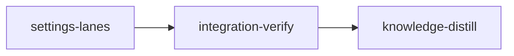

# Plan: Settings dialog as lanes with paired rows

## Overview

Rebuild the web dashboard's settings dialog (`web/src/components/settings-*`) to the approved
"direction A + B" design, version 4 of the design studies: the three configuration tiers
(built-in, user, project) become the columns of one table, so a key reads left to right in loom's
own resolution order and the rightmost set value wins; the fourteen `*_model` / `*_effort` keys
read as seven paired rows with model and effort side by side; a filter box in the dialog header
takes `/`; below 700px the same model renders as one card per row with the tiers stacked. The
wire model (`/api/config`), the one-key-per-write contract, the CSRF flow and the `?settings=`
URL contract do not change. The approved mock is committed at
`doc/plans/briefs/settings-lanes/settings-lanes/mockup.html` and is the design reference; the
four worker briefs beside it carry the task detail.

## Goals

- Every one of the registry's 18 keys is editable at every tier that can hold it, from one view,
  with no scope switch: the cascade is the layout.
- Pairs by suffix: a section whose keys come in `<prefix>_model` / `<prefix>_effort` pairs
  renders one row per prefix with two sub-columns per lane; an unpaired key stays a single row.
- The tier in effect is marked per control (model and effort resolve independently), and the key
  cell prints the resolved pair.
- A user-only section shows its project lane once, as an aurora-ui `EmptyState`, spanning the
  section.
- Pending and rejected writes use aurora-ui's vocabulary: `BusyRoundel` beside the control,
  hazard stripes on the cell with the validator message in a `hazard-text` chip.
- Filter over names, help, captions and values at every tier; `/` focuses it from anywhere in
  the dialog.
- Phone layout from the same model and the same controls, chosen by a media query at 700px.
- `web/dist` rebuilt and committed, since `loom/build.rs` embeds it.

Non-goals: any change to `web/src/api/**`, to the Rust config API, to the registry, or to the
TUI; units on numbers (the wire carries none); a project tier for keys the registry does not
allow one for.

## Design decisions (settled)

- **Pairing lives in the frontend**, by suffix, in `settings-model.ts::sectionRows`. The wire
  and the registry are untouched. Row captions for the pressure section are a frontend table
  (`ROW_CAPTIONS`), since the registry's help text is per key.
- **Lane tones**: user = `--tone-executing` (blue), project = `--tone-completed` (green),
  built-in = `--tone-dimmed`, declared as `--lane-*` on the dialog root. The old gray-for-user
  read as disabled.
- **Effective marker** is `data-effective="true"` on the control's slot plus sr-only text
  `in effect`; never `aria-current` on a form control.
- **Editable number fields show raw digits**; read-only pills and the resolved summary group
  them (`formatValue`). The server's validator owns the rules, as today.
- **`useOpenSettings()` takes no argument** and sets `?settings=1`. Its only caller,
  `web/src/components/header.tsx:45`, already passes nothing. The scope value in the param is
  no longer read.
- **`settings-row.tsx` is deleted** with its provenance rail, tags and reset button. `WriteStatus`
  moves to `settings-model.ts`, `statusKey` too. `railStops`/`RailStop` retire (grep: their only
  importer was `settings-row.tsx`).
- **Both layouts render from one `sections` array**; the dialog picks table or cards with
  `useMediaQuery("(max-width: 699px)")`. Tests get the table by default because
  `web/src/test/setup.ts` stubs `matchMedia` with `matches: false`.

## Contract from W1 (foundation; W2, W3, W4 compile against it)

Written by W1 in `web/src/components/settings-model.ts`, `settings-control.tsx`,
`web/src/lib/use-media-query.ts`; full detail in the W1 brief.

    // settings-model.ts (existing exports kept: USER_CONFIG_PATH, SCOPES, scopePath, sectionOf,
    // fieldOf, Section, groupBySection, Provenance, provenanceAt, valueAt, fallbackFor, displayValue)
    export type Lane = "builtin" | "user" | "project";
    export const LANES: readonly { lane: Lane; label: string; path: string | null; blurb: string }[];
    export function effectiveLane(entry: ConfigEntry): Lane;
    export type LaneProvenance = Provenance | "readonly";
    export interface LaneState { lane: Lane; value: string | null; provenance: LaneProvenance; effective: boolean }
    export function laneState(entry: ConfigEntry, lane: Lane): LaneState;
    export function laneScope(lane: Lane): ConfigScope | null;
    export interface PairRow { kind: "pair"; label: string; caption: string | null; model: ConfigEntry; effort: ConfigEntry }
    export interface SingleRow { kind: "single"; entry: ConfigEntry }
    export type SettingsRow = PairRow | SingleRow;
    export interface SectionRows { section: string; caption: string | null; projectAllowed: boolean; rows: SettingsRow[] }
    export function sectionRows(entries: ConfigEntry[]): SectionRows[];
    export function rowEntries(row: SettingsRow): ConfigEntry[];
    export function rowLabel(row: SettingsRow): string;
    export function filterSections(sections: SectionRows[], query: string): SectionRows[];
    export function formatValue(kind: ConfigKind, value: string): string;
    export type WriteStatus = { phase: "idle" } | { phase: "pending"; value: string | null } | { phase: "saved" } | { phase: "error"; message: string };
    export function statusKey(scope: ConfigScope, name: string): string;
    export const SECTION_CAPTIONS: Readonly<Record<string, string>>;
    export const ROW_CAPTIONS: Readonly<Record<string, string>>;

    // settings-control.tsx
    export interface ControlProps { id: string; kind: ConfigKind; value: string; pending: boolean; invalid: boolean; label: string; describedBy?: string; onCommit: (value: string) => void }
    export function ValueControl(props: ControlProps): ReactElement;
    export interface LaneSlotProps { entry: ConfigEntry; lane: "user" | "project"; status: WriteStatus; controlId: string; onWrite: (value: string | null) => void }
    export function LaneSlot(props: LaneSlotProps): ReactElement;
    export function BuiltinValue(props: { entry: ConfigEntry }): ReactElement;

    // lib/use-media-query.ts
    export function useMediaQuery(query: string): boolean;

    // shared by W2's SettingsLanes and W3's SettingsCards (each declares it; identical)
    interface SettingsTableProps { data: ConfigSnapshot; sections: SectionRows[]; query: string; statuses: Record<string, WriteStatus>; onWrite: (scope: ConfigScope, name: string, value: string | null) => void }

## Grounding (read at planning time, 2026-09-12)

- `web/src/components/settings-dialog.tsx` (322 lines): `SETTINGS_PARAM`, `useOpenSettings(scope?)`,
  `Body` with `LoadState`, `write` with the 403 reload, `ScopeSwitch`, `Entries`, `statusKey`,
  `replaceEntry`. Consumers: `web/src/routes/shell.tsx:51` mounts `<SettingsDialog />`;
  `web/src/components/header.tsx:22,45` calls `useOpenSettings()` with no argument. No other
  importer (`rg -n 'settings-dialog' web/src`).
- `settings-row.tsx` (179 lines) exports `SettingRow`, `WriteStatus`, `SettingRowProps`;
  imported only by `settings-dialog.tsx`. `settings-control.tsx` (126 lines) exports
  `ValueControl`, `ControlProps`; imported only by `settings-row.tsx`. `settings-model.ts`
  (114 lines) is imported by both. `settings.css` (396 lines) is imported from
  `web/src/index.css:18`.
- `web/src/api/config.ts`: `ConfigEntry { name, help, kind, scopes, default, user: {value,set}, project: {value,set} | null, effective: {value, source: "project"|"user"|"default"} }`;
  `ConfigClient { load, write(csrf, {scope, name, value|null}) }`. Unchanged by this plan.
- `web/src/api/fixtures/config.json`: 18 entries, `project.available: true`, sources cover
  `user`, `default`, `project` (`python3 -c` over the file at planning time). Pinned by the Rust
  test `the_config_fixture_matches_a_real_payload`; nothing here changes it.
- aurora-ui vendored at `web/src/aurora-ui/`: `feedback/EmptyState.tsx` (`icon`, `title`,
  `description`, `variant: "card"|"bare"`, `tone: "primary"|"muted"|"emerald"`, `size: "sm"|"default"`,
  `className`), `feedback/BusyRoundel.tsx` (`busy`, `size`, `busyLabel`, `idleLabel`,
  `className`; its live region is a separate sr-only node), `feedback/hazard.css`
  (`.hazard-error` stripes, `.hazard-text`) — all imported already via `index.css:11-14`;
  precedent imports at `web/src/routes/stage.tsx:5`, `web/src/components/attention-panel.tsx:6`.
- shadcn primitives present under `web/src/components/ui/`: badge, button, dialog, kbd,
  scroll-area, separator, skeleton, table, tooltip. `DialogContent` (`ui/dialog.tsx:64`) carries
  `max-w-[calc(100%-2rem)] ... sm:max-w-sm`; the settings dialog overrides with `sm:max-w-[980px]`.
- Theme: dark mode is the `.dark` class on `<html>` (`architecture/web-dashboard.md`, "Graph
  view and vendored aurora-ui"); new CSS uses `.dark` selectors. Typography convention
  (`conventions/web-dashboard-typography.md`): chrome in Inter 12-13px weight 500 sentence
  case; mono only for identifiers and values.
- Gates: `web/package.json` scripts `check = typecheck && lint && format:check && test`,
  `build = tsc -b && vite build`; lockfile is `web/bun.lock`; vitest 5 with jsdom and
  `src/test/setup.ts`. `web/dist` is committed and embedded by `loom/build.rs`
  (`architecture/web-dashboard.md`, "Committed dist + build.rs embedding").
- Baselines observed at HEAD (`255891fd`) from the main checkout: `cd web && bun run check` →
  exit 0, `Test Files 25 passed (25)`, `Tests 273 passed (273)`; `cargo fmt --check && cargo clippy --all-targets -- -D warnings && cargo build --all-targets` (in `loom/`) → exit 0.
  The remaining integration-verify criteria are copied verbatim from the sibling
  `doc/plans/IN_PROGRESS-PLAN-web-dashboard.md` integration-verify stage, which ran them green
  on this tree; the full `cargo test --all-targets` was not re-run at planning time.
- Vitest's summary line reads `Test Files  N passed (N)` (observed in the baseline run), which
  the stage's `rg` criterion matches with `Test Files +3 passed`.
- Knowledge: `doc/loom/knowledge/INDEX.md` exists (hierarchical), `loom knowledge sync` reports
  the catalog current, so there is no knowledge-bootstrap stage (same as the sibling web plans).

## Execution Diagram



## Stages

### 1. `settings-lanes` (standard)

One stage, four sonnet workers in three waves, all inside one worktree. Stage Necessity Test:
Q1 no (nothing needs an intermediate merge; W2/W3 depend on W1 by compile order only, which is
a foundation wave, not a stage), Q2 no (one writer per file, table below), Q3 no, Q4 no (the
whole change is about 1,500 lines of TS/CSS plus a dist rebuild).

The orchestrator (stage default model) spawns every worker BY AGENT TYPE
(`loom-software-engineer`, sonnet) with the fixed prompt plus
`Your brief: <path>. Read it in full before anything else.` Each brief tells the worker to load
`frontend-design:frontend-design` (W2, W3) and `loom-skills` `loom-react loom-typescript`
(all). The user asked for sonnet wherever possible: every worker is sonnet; escalate one tier
only on a failed attempt with evidence, per CLAUDE.md Rule 7.

| Worker | Role | Tier | Files owned (write) | Shared context (read-only) | Brief path |
| --- | --- | --- | --- | --- | --- |
| W1 | model, controls, media query (foundation) | sonnet | `web/src/components/settings-model.ts`, `web/src/components/settings-model.test.ts`, `web/src/components/settings-control.tsx`, `web/src/lib/use-media-query.ts` | `web/src/api/config.ts`, `web/src/api/fixtures/config.json`, `web/src/components/settings-row.tsx`, `web/src/aurora-ui/feedback/BusyRoundel.tsx`, `web/src/test/setup.ts` | `doc/plans/briefs/settings-lanes/settings-lanes/w1-model-controls.md` |
| W2 | dialog, lanes table, stylesheet | sonnet | `web/src/components/settings-dialog.tsx`, `web/src/components/settings-lanes.tsx`, `web/src/components/settings.css`, deletes `web/src/components/settings-row.tsx` | W1's files, `web/src/components/ui/{dialog,kbd,button}.tsx`, `web/src/aurora-ui/feedback/EmptyState.tsx`, `hazard.css`, `web/src/index.css`, `web/src/routes/shell.tsx`, `web/src/components/header.tsx` | `doc/plans/briefs/settings-lanes/settings-lanes/w2-lanes-dialog.md` |
| W3 | phone card list | sonnet | `web/src/components/settings-cards.tsx`, `web/src/components/settings-cards.css`, one `@import` line in `web/src/index.css` | W1's files, `web/src/components/state-badge.tsx` | `doc/plans/briefs/settings-lanes/settings-lanes/w3-cards.md` |
| W4 | component tests | sonnet | `web/src/components/settings-dialog.test.tsx`, `web/src/components/settings-cards.test.tsx` | every `settings-*` source, `web/src/test/setup.ts`, `web/src/router.tsx` | `doc/plans/briefs/settings-lanes/settings-lanes/w4-tests.md` |

Waves: W1 alone → W2 and W3 in ONE message → W4 after `bun run typecheck` is green. Territories
are DISJOINT (W3's one-line edit to `index.css` is the only touch of that file). Workers NEVER
spawn subagents.

Orchestrator steps, in order:

1. `cd web && bun install --frozen-lockfile` — a fresh worktree has no `node_modules`, and the
   sandbox denies the main checkout's `.vite-temp` writes.
2. Spawn W1; harvest; run `cd web && bun run typecheck` (it will fail on `settings-row.tsx`'s
   `railStops` import until W2 deletes the file — that is expected; confirm W1's own test file
   passes with `bunx vitest run src/components/settings-model.test.ts`).
3. Spawn W2 and W3 in one message; harvest both; `bun run typecheck && bun run lint && bun run format:check`;
   fix seams between them (a class name, a prop) with a fresh sonnet subagent briefed with the
   diff, never by hand.
4. Spawn W4; harvest; `bun run check`. A failing test is triaged by W4's report: a test bug goes
   back to a fresh sonnet with the report; a component bug goes to a fresh sonnet with the
   component line; a second failure of the same bug goes to `loom-advisor` first (Rule 7).
5. Visual review, once, from the Vite dev server against a running `loom status --web` in the
   worktree (`cd web && bun run dev`, open the dialog, both themes via the header toggle, the
   window narrowed under 700px), compared against the mock. Anything off goes to a fresh sonnet
   with a screenshot description; fable only if a sonnet attempt failed.
6. `cd web && bun run build`, confirm `git status --short --untracked-files=all web/dist` shows
   the rebuilt bundle, then `cargo build --manifest-path loom/Cargo.toml` so the embedded
   assets recompile.
7. Mini adversarial code review, findings fixed by a sonnet subagent, gate green again.
8. Commits in logical groups: `feat(web): settings dialog as lanes with paired rows`
   (sources + tests + briefs' mock if changed), `chore(web): rebuild the dashboard bundle for
   the settings lanes` (dist only). Then `loom stage complete settings-lanes`.

Size limits: no file over 400 lines, no function over 50; W2 splits `settings-lanes.tsx` into
`settings-lanes-cells.tsx` if it grows past that (it then owns both).

MEMORY: record mistakes, decisions and surprises via `loom memory` immediately (workers too);
never `loom knowledge` in this stage; never Claude Code auto-memory.

Acceptance (working_dir `.`): the full web gate; the dist-freshness check; the old row file
gone; the three settings test files selected and passing; the cards stylesheet imported.
Artifacts and wiring prove the new components are rendered by the dialog, the roundel and empty
state are used, and the dialog is still mounted by the shell.

### 2. `integration-verify`

The repository's canonical gate copied from the sibling web-dashboard plan (fmt, build, clippy,
rustdoc, full test suite under the hook's `env -u` prefix, `cargo deny`, `cargo audit`,
markdownlint without `--fix`, `bun run check`, dist freshness, the smoke script), plus
settings-specific proof: the three settings test files pass, the built bundle carries the
filter placeholder string and the lanes stylesheet classes (so the embedded assets are the new
ones), and `scripts/smoke-web-dashboard.sh` still passes against the built binary. Then parallel
`loom-code-reviewer` subagents (security, architecture, test coverage) with every finding fixed
by a sonnet subagent, and a functional pass: the dialog opens from the header button on the
served page, `/api/config` GET returns the entries the dialog renders, a write at user scope
round-trips through the served API into a scratch `HOME` (see the stage description for the
`H=$(mktemp -d ...)` form; never a bare `HOME=`).

### 3. `knowledge-distill`

Curate the stage memories into `doc/loom/knowledge/` (the settings dialog's structure belongs
under `architecture/web-dashboard.md`'s "Config read/write surface" section as a correction via
`replace-section`, since that section describes `settings-row.tsx` and the scope switch, which no
longer exist), apply every `stale-knowledge:` memory first, update `web/README.md` if it
describes the dialog, and resolve every memory with a receipt.

---

<!-- loom METADATA -->

```yaml
loom:
  version: 1
  sandbox:
    enabled: true
    auto_allow: true
    allow_unsandboxed_escape: false
    excluded_commands: []
    filesystem:
      deny_read:
        - ~/.ssh/**
        - ~/.aws/**
        - ~/.config/gcloud/**
        - ~/.gnupg/**
        - .loom/work/admin.token
        - .loom/work/user.token
        - ../.loom/work/admin.token
        - ../.loom/work/user.token
        - .work/admin.token
        - .work/user.token
        - ../.work/admin.token
        - ../.work/user.token
        - ../../**
        - ../.worktrees/**
      deny_write:
        - ../../**
      allow_write:
        - loom/**
        - web/**
        - scripts/**
        - doc/plans/briefs/settings-lanes/**
        - README.md
    network:
      allowed_domains:
        - crates.io
        - static.crates.io
        - index.crates.io
        - registry.npmjs.org
        - github.com
      additional_domains: []
      allow_local_binding: true
      allow_unix_sockets: []
      allow_all_unix_sockets: false
    linux:
      enable_weaker_nested: false
    command_confinement: confined
  stages:
    - id: settings-lanes
      name: "Settings dialog as lanes with paired rows"
      stage_type: standard
      subagent_timeout_secs: 600
      description: |
        Rebuild web/src/components/settings-* to the approved direction A+B design:
        doc/plans/briefs/settings-lanes/settings-lanes/mockup.html (open it in a browser and read
        it; the .lp table and the .phone card list are the design, the page chrome is not).
        Use parallel subagents and skills to maximize performance.

        YOU ORCHESTRATE, WORKERS IMPLEMENT. Spawn every worker BY AGENT TYPE
        (loom-software-engineer, sonnet) with the fixed prompt plus
        "Your brief: <path>. Read it in full before anything else." Every brief tells the worker
        which skills to load (frontend-design:frontend-design for W2 and W3; loom-skills
        loom-react loom-typescript for all). The user asked for sonnet wherever possible: never
        spawn a higher tier on a first attempt; a fix that failed once against clear acceptance
        moves up exactly one tier with the evidence in the new brief.

        | Worker | Role | Tier | Files owned | Shared context | Brief path |
        | --- | --- | --- | --- | --- | --- |
        | W1 | model, controls, media query (foundation) | sonnet | web/src/components/settings-model.ts, web/src/components/settings-model.test.ts, web/src/components/settings-control.tsx, web/src/lib/use-media-query.ts | web/src/api/config.ts, web/src/api/fixtures/config.json, web/src/components/settings-row.tsx, web/src/aurora-ui/feedback/BusyRoundel.tsx, web/src/test/setup.ts | doc/plans/briefs/settings-lanes/settings-lanes/w1-model-controls.md |
        | W2 | dialog, lanes table, stylesheet | sonnet | web/src/components/settings-dialog.tsx, web/src/components/settings-lanes.tsx, web/src/components/settings.css, DELETE web/src/components/settings-row.tsx | W1 files, web/src/components/ui/dialog.tsx, ui/kbd.tsx, ui/button.tsx, web/src/aurora-ui/feedback/EmptyState.tsx, hazard.css, web/src/index.css, web/src/routes/shell.tsx, web/src/components/header.tsx | doc/plans/briefs/settings-lanes/settings-lanes/w2-lanes-dialog.md |
        | W3 | phone card list | sonnet | web/src/components/settings-cards.tsx, web/src/components/settings-cards.css, ONE @import line in web/src/index.css | W1 files, web/src/components/state-badge.tsx | doc/plans/briefs/settings-lanes/settings-lanes/w3-cards.md |
        | W4 | component tests | sonnet | web/src/components/settings-dialog.test.tsx, web/src/components/settings-cards.test.tsx | every settings-* source, web/src/test/setup.ts, web/src/router.tsx | doc/plans/briefs/settings-lanes/settings-lanes/w4-tests.md |

        Territories are DISJOINT. Workers NEVER spawn subagents. WAVES: W1 alone (its exports are
        the contract the others compile against; the plan's "Contract from W1" section quotes
        it) -> W2 and W3 in ONE message -> W4 once `cd web && bun run typecheck` is green.

        ORCHESTRATOR STEPS:
        1. cd web && bun install --frozen-lockfile (a fresh worktree has no node_modules; the
           sandbox denies writes to the main checkout's node_modules/.vite-temp).
        2. Spawn W1; harvest (loom subagents watch --timeout 3600 in the background, then
           harvest); run cd web && bunx vitest run src/components/settings-model.test.ts. A full
           typecheck fails until W2 deletes settings-row.tsx (it imports railStops) - expected.
        3. Spawn W2 and W3 in one message; harvest; cd web && bun run typecheck && bun run lint
           && bun run format:check. Seam fixes between them go to a FRESH sonnet subagent briefed
           with the diff - never typed by you.
        4. Spawn W4; harvest; cd web && bun run check. Triage failures from W4's report: test bug
           -> fresh sonnet with the report; component bug -> fresh sonnet with the component
           line; the same bug failing twice -> loom-advisor first, then re-dispatch.
        5. Visual review ONCE: cd web && bun run dev with loom status --web running in the
           worktree; open ?settings=1; both themes (header toggle); window under 700px for the
           cards. Compare to the mock. Deviations go to a fresh sonnet with a precise
           description; fable only after a sonnet attempt failed.
        6. cd web && bun run build; confirm git status --short --untracked-files=all web/dist
           lists the rebuilt bundle; cargo build --manifest-path loom/Cargo.toml so the embedded
           assets recompile.
        7. Mini adversarial code review; findings fixed by a sonnet subagent; gate green again.
        8. Commit in two groups - feat(web): settings dialog as lanes with paired rows (sources,
           tests, briefs) and chore(web): rebuild the dashboard bundle for the settings lanes
           (web/dist only) - then loom stage complete settings-lanes.

        DECISIONS (settled, do not reopen): pairing by _model/_effort suffix in the frontend;
        lane tones user=--tone-executing, project=--tone-completed, built-in=--tone-dimmed;
        effective marker is data-effective="true" on the slot plus sr-only "in effect";
        editable numbers show raw digits, read-only values are grouped; useOpenSettings() takes
        no argument; settings-row.tsx is deleted; both layouts render from one sections array.

        SIZE LIMITS: 400 lines per file, 50 per function. web/src/index.css gains exactly one
        line. Nothing under web/src/api/** changes.

        MEMORY: record mistakes, decisions and surprises via loom memory immediately (workers
        too). NEVER loom knowledge in this stage. NEVER Claude Code auto-memory.
      dependencies: []
      acceptance:
        - 'cd web && bun install --frozen-lockfile && bun run check'
        - 'cd web && bun run build >/dev/null 2>&1 && test -z "$(git status --short --untracked-files=all dist)"'
        - 'test ! -f web/src/components/settings-row.tsx'
        - 'cd web && NO_COLOR=1 bunx vitest run src/components/settings-model.test.ts src/components/settings-dialog.test.tsx src/components/settings-cards.test.tsx 2>&1 | rg -q "Test Files +3 passed"'
        - 'rg -qF "./components/settings-cards.css" web/src/index.css'
        - 'rg -qF "settings-slot" web/dist/assets/index.css'
        - 'rg -qF "filter keys, values, help" web/dist/assets/index.js'
      files:
        - "web/src/components/settings-*.ts"
        - "web/src/components/settings-*.tsx"
        - "web/src/components/settings-*.css"
        - "web/src/lib/use-media-query.ts"
        - "web/src/index.css"
        - "web/dist/**"
        - "doc/plans/briefs/settings-lanes/**"
      working_dir: "."
      artifacts:
        - "web/src/components/settings-model.ts"
        - "web/src/components/settings-model.test.ts"
        - "web/src/components/settings-control.tsx"
        - "web/src/components/settings-dialog.tsx"
        - "web/src/components/settings-lanes.tsx"
        - "web/src/components/settings-cards.tsx"
        - "web/src/components/settings-cards.css"
        - "web/src/components/settings.css"
        - "web/src/components/settings-dialog.test.tsx"
        - "web/src/components/settings-cards.test.tsx"
        - "web/src/lib/use-media-query.ts"
      wiring:
        - source: "web/src/components/settings-dialog.tsx"
          pattern: "<SettingsLanes"
          description: "The dialog renders the lanes table"
        - source: "web/src/components/settings-dialog.tsx"
          pattern: "<SettingsCards"
          description: "The dialog renders the phone card list"
        - source: "web/src/components/settings-dialog.tsx"
          pattern: "useMediaQuery\\("
          description: "The layout switch reads the media query"
        - source: "web/src/components/settings-dialog.tsx"
          pattern: "filterSections\\("
          description: "The filter box narrows the sections"
        - source: "web/src/components/settings-lanes.tsx"
          pattern: "<EmptyState"
          description: "The user-only pane is aurora-ui's EmptyState"
        - source: "web/src/components/settings-control.tsx"
          pattern: "<BusyRoundel"
          description: "A pending write shows aurora-ui's roundel"
        - source: "web/src/components/settings-lanes.tsx"
          pattern: "<LaneSlot"
          description: "Table cells render W1's lane slot"
        - source: "web/src/components/settings-cards.tsx"
          pattern: "<LaneSlot"
          description: "Card tiers render W1's lane slot"
        - source: "web/src/routes/shell.tsx"
          pattern: "<SettingsDialog />"
          description: "The dialog is still mounted by the app shell"
        - source: "web/src/components/header.tsx"
          pattern: "useOpenSettings\\(\\)"
          description: "The header still opens the dialog"

    - id: integration-verify
      name: "Integration Verification"
      stage_type: integration-verify
      description: |
        Final verification after settings-lanes. Verify FUNCTIONAL INTEGRATION, not just tests
        passing. NEVER Claude Code auto-memory.
        CONTEXT: read doc/plans/PLAN-settings-lanes.md, loom memory show --all, and the
        Knowledge Brief; pull doc/loom/knowledge only when the brief is silent.
        BUILD WARM FIRST: cargo build --all-targets --manifest-path loom/Cargo.toml before the
        gate (300 s ceiling per criterion).
        BUILD & TEST (zero tolerance, fix ALL warnings/errors, nothing is pre-existing): the
        gate below is the pre-push hook's list, copied from the sibling web-dashboard plan, plus
        the web gate, dist freshness, and the settings-specific criteria. Sandbox-sensitive Rust
        tests self-skip through process/sandbox_probe.rs; never add a --skip list. Do NOT pass
        --fix to markdownlint. A non-zero bunx exit can mean the tool never ran (no cache, no
        registry): read the markdownlint-cli2 banner before concluding markdown is broken.
        CODE REVIEW: spawn parallel loom-code-reviewer subagents (security via
        Skill loom-skills loom-security-audit; architecture; test coverage) over
        web/src/components/settings-* and web/src/lib/use-media-query.ts; fix ALL findings with
        a sonnet loom-software-engineer subagent; gate green again.
        FUNCTIONAL: prove the dialog is WIRED IN. (1) scripts/smoke-web-dashboard.sh against the
        built binary. (2) In a scratch workspace with a scratch HOME - written as
        H=$(mktemp -d "${TMPDIR:-/tmp}/loom-settings.XXXXXX") && [ -n "$H" ] && ... chained
        with && only, never a bare or possibly-empty HOME= - start loom status --web 0, GET
        /api/config and confirm it parses with 18 entries and a csrf_token, POST one user-scope
        write with the Origin and X-Loom-Csrf headers the frontend sends
        (web/src/api/config.ts) and confirm the returned entry has user.set true, then confirm
        $H/.loom/config.toml carries the key; kill the server. (3) Served page: curl / and
        confirm the bundle it references is the one containing the filter placeholder string.
        (4) With bun run dev proxied at the server, open ?settings=1 once in a browser if one is
        available in this environment; otherwise record in memory that the visual pass was done
        in the settings-lanes stage.
        Record discoveries to loom memory for knowledge-distill, including any knowledge file
        contradicted by the tree: loom memory note "stale-knowledge: ...". The "Config
        read/write surface" section of architecture/web-dashboard.md names settings-row.tsx and
        the scope switch, which this plan removes - record that.
      dependencies: ["settings-lanes"]
      acceptance:
        - 'cargo fmt --check --manifest-path loom/Cargo.toml'
        - 'cargo build --all-targets --manifest-path loom/Cargo.toml'
        - 'cargo clippy --all-targets --manifest-path loom/Cargo.toml -- -D warnings'
        - 'RUSTDOCFLAGS="-D warnings" cargo doc --workspace --all-features --no-deps --manifest-path loom/Cargo.toml'
        - 'env -u GIT_INDEX_FILE -u GIT_DIR -u GIT_WORK_TREE -u LOOM_STAGE_ID -u LOOM_SESSION_ID cargo test --all-targets --no-fail-fast --manifest-path loom/Cargo.toml'
        - 'cargo deny --manifest-path loom/Cargo.toml check licenses bans sources'
        - 'cargo audit -f loom/Cargo.lock -d loom/target/advisory-db'
        - 'bunx markdownlint-cli2 README.md loom/CONTRIBUTING.md web/README.md "doc/loom/knowledge/**/*.md"'
        - 'bunx markdownlint-cli2 README.md 2>&1 | rg -q "markdownlint-cli2 v"'
        - 'cd web && bun install --frozen-lockfile && bun run check'
        - 'cd web && bun run build >/dev/null 2>&1 && test -z "$(git status --short --untracked-files=all dist)"'
        - 'test -s web/dist/index.html && test -s web/dist/assets/index.js && test -s web/dist/assets/index.css'
        - 'cd web && NO_COLOR=1 bunx vitest run src/components/settings-model.test.ts src/components/settings-dialog.test.tsx src/components/settings-cards.test.tsx 2>&1 | rg -q "Test Files +3 passed"'
        - 'rg -qF "filter keys, values, help" web/dist/assets/index.js'
        - 'rg -qF "settings-slot" web/dist/assets/index.css'
        - 'rg -qF "settings-card" web/dist/assets/index.css'
        - 'test ! -f web/src/components/settings-row.tsx'
        - 'loom/target/debug/loom status --help | rg -q -- "--web"'
        - 'scripts/smoke-web-dashboard.sh loom/target/debug/loom'
      working_dir: "."
      wiring:
        - source: "web/src/routes/shell.tsx"
          pattern: "<SettingsDialog />"
          description: "The dialog is mounted by the app shell"
        - source: "web/src/components/settings-dialog.tsx"
          pattern: "<SettingsLanes"
          description: "The dialog renders the lanes table"
        - source: "web/src/components/settings-dialog.tsx"
          pattern: "<SettingsCards"
          description: "The dialog renders the phone card list"
      wiring_tests:
        - name: "the built bundle is the lanes build"
          command: 'rg -c "settings-lane-user" web/dist/assets/index.css'
          success_criteria:
            exit_code: 0

    - id: knowledge-distill
      name: "Knowledge Distillation"
      stage_type: knowledge-distill
      description: |
        Curate all stage memories into permanent knowledge; update user docs.
        NEVER Claude Code auto-memory.
        SINGLE-AGENT: do NOT spawn subagents - memories are compact summaries; lean on them and
        keep code spot-reads narrow.
        Read the plan (doc/plans/PLAN-settings-lanes.md) + loom memory show --all +
        doc/loom/knowledge/INDEX.md and the sections it points to for the web dashboard.
        CORRECTIONS FIRST: apply every stale-knowledge memory in place with
        loom knowledge replace-section <file> "<heading>" "<body>" - never with loom knowledge
        update, which appends the fix below the stale text. The "Config read/write surface
        (/api/config)" section of architecture/web-dashboard.md describes settings-row.tsx and
        the ?settings=<scope> switch; replace its React-side paragraph with the lanes structure
        (settings-model.ts sectionRows/filterSections, settings-lanes.tsx, settings-cards.tsx,
        settings-control.tsx LaneSlot/BuiltinValue, use-media-query.ts, the 700px switch, the
        data-effective marker, the lane tones). Keep the server-side paragraphs intact.
        Then curate mistakes (prevention rules), patterns, decisions, conventions via loom
        knowledge update. TIER ROUTING: findings ~40 lines or fewer go inline in the tier-1
        file; larger findings go via loom knowledge update <category>/<slug> with a 2-4 line
        tier-1 summary + link. INDEX.md regenerates automatically on every knowledge write; then
        loom review prunes stale entries.
        Update web/README.md and README.md only where they describe the settings dialog; if
        nothing user-facing changed there, skip but record WHY in memory.
        RECEIPTS: every Note/Decision/Question taken into knowledge gets
        loom memory resolve <id> --outcome promoted|merged|discarded|deferred right after the
        write that used it (--target/--reason as appropriate); finish with
        loom memory pending --strict and resolve whatever it lists.
      dependencies: ["integration-verify"]
      acceptance:
        - 'rg -q "## " doc/loom/knowledge/architecture.md'
        - 'rg -q "## " doc/loom/knowledge/patterns.md'
        - 'rg -qF "settings-lanes.tsx" doc/loom/knowledge/architecture/web-dashboard.md'
        - 'loom knowledge check --strict'
        - 'loom memory pending --strict'
      files: ["doc/loom/knowledge/**", "README.md", "web/README.md"]
      working_dir: "."
```

<!-- END loom METADATA -->
